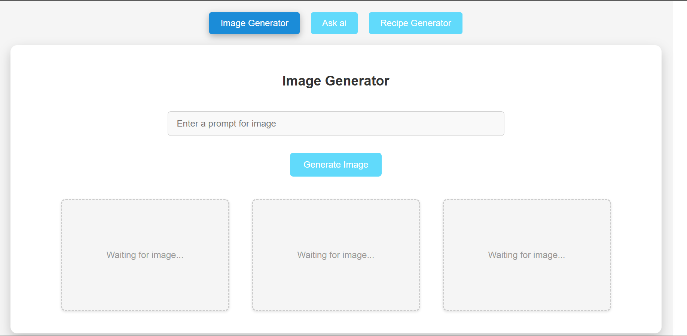
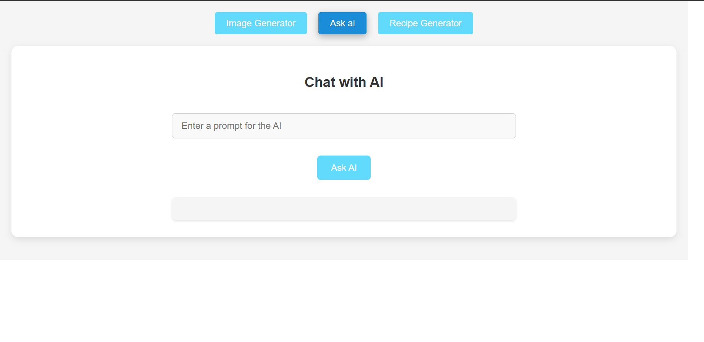
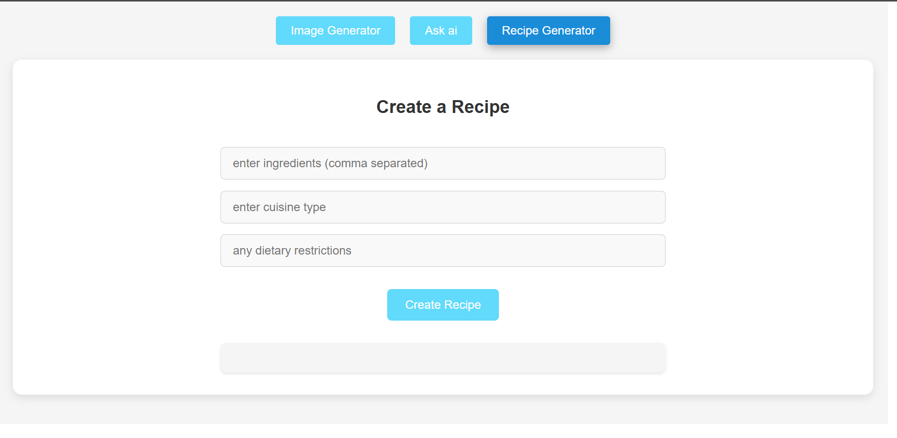

# AI Project: Image, Recipe, and Chat Generator

## Overview

This project is a React-based application that leverages the OpenAI API to provide users with the ability to generate images, create recipes, and engage in chat. The application aims to demonstrate the capabilities of AI in creative and practical domains.

## Features

- **Image Generation**: Generate unique images based on user prompts using OpenAI's image generation capabilities.
- **Recipe Creation**: Create personalized recipes based on user preferences and dietary restrictions.
- **Chat Functionality**: Engage in interactive conversations with the AI, allowing users to ask questions and receive informative responses.

## Table of Contents

- [Technologies Used](#technologies-used)
- [Installation](#installation)
- [Usage](#usage)
- [API Integration](#api-integration)
- [Contributing](#contributing)
- [License](#license)
- [Contact](#contact)

## Technologies Used

- **Frontend**: 
  - React
  - React Router
  - Axios (for API requests)

- **Backend**: 
  - Node.js (if applicable)
  - Express (if applicable)

- **AI Integration**: 
  - OpenAI API

## Installation

To set up this project locally, follow these steps:

1. **Clone the repository**:
   ```bash
   git clone https://github.com/MugoSimon/spring-ai.git
   ```

2. **Navigate to the project directory**:
   ```bash
   cd spring-ai
   ```

3. **Install dependencies**:
   ```bash
   npm install
   ```

4. **Set up environment variables**:
   Create a `.env` file in the root directory and add your OpenAI API key:
   ```
   REACT_APP_OPENAI_API_KEY=your_openai_api_key_here
   ```

5. **Start the application**:
   ```bash
   npm start
   ```

6. **Open your browser**: Navigate to `http://localhost:3000` to view the application.

## Usage

### Image Generation
- Navigate to the **Image Generation** section.
- Enter a prompt describing the image you want to generate.
- Click the **Generate Image** button to see the AI-generated image.

### Recipe Creation
- Go to the **Recipe Creation** section.
- Input your preferences (e.g., ingredients, dietary restrictions).
- Press the **Create Recipe** button to receive a customized recipe.

### Chat Functionality
- Access the **Chat** section.
- Type your question or prompt in the chat input.
- Click **Send** to receive a response from the AI.

## API Integration

This project uses the OpenAI API for generating images, recipes, and chat responses. Ensure you have a valid API key and have set it up in your `.env` file.

### API Endpoints
- **Image Generation**: 
  - Endpoint: `http://localhost:8080/generate-image?prompt=`
  - Method: `GET`
  - Payload: `{ "prompt": "your_prompt_here", "n": 1, "size": "1024x1024" }`

- **Recipe Generation**: 
  - Endpoint: `http://localhost:8080/generate-recipe?ingredients=`
  - Method: `GET`
  - Payload: `{ "ingredients": ["ingredient1", "ingredient2"], "diet": "vegan" }`

- **Chat**: 
  - Endpoint: `http://localhost:8080/ask-ai?prompt=hello?`
  - Method: `GET`
  - Payload: `{ "prompt": [{"role": "user", "content": "your_message_here"}] }`

## Contributing

Contributions are welcome! If you would like to contribute to this project, please follow these steps:

1. Fork the repository.
2. Create a new branch (`git checkout -b feature/YourFeature`).
3. Make your changes and commit them (`git commit -m 'Add some feature'`).
4. Push to the branch (`git push origin feature/YourFeature`).
5. Open a pull request.

## License

This project is licensed under the MIT License - see the [LICENSE](LICENSE) file for details.

## Contact

For questions or feedback, please reach out to:
- **GitHub**: [MugoSimon](https://github.com/MugoSimon)

---
## Screenshot




